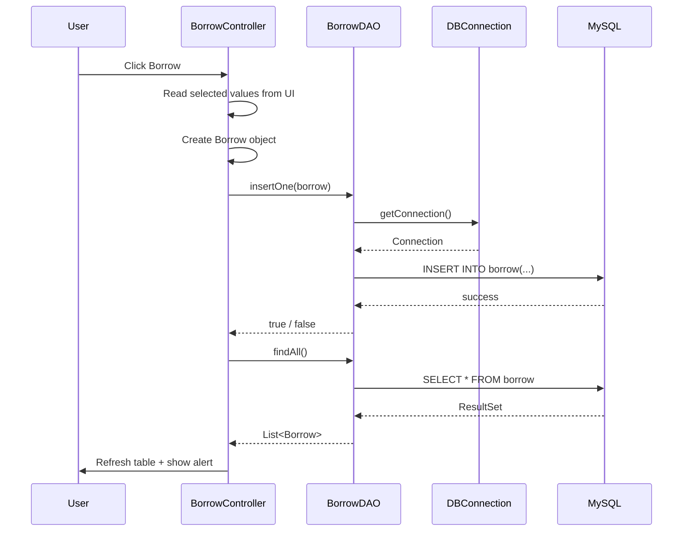
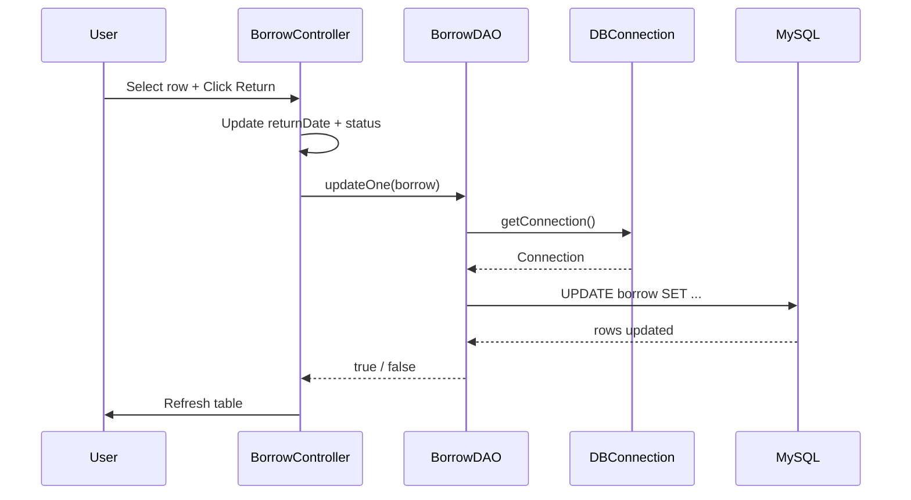
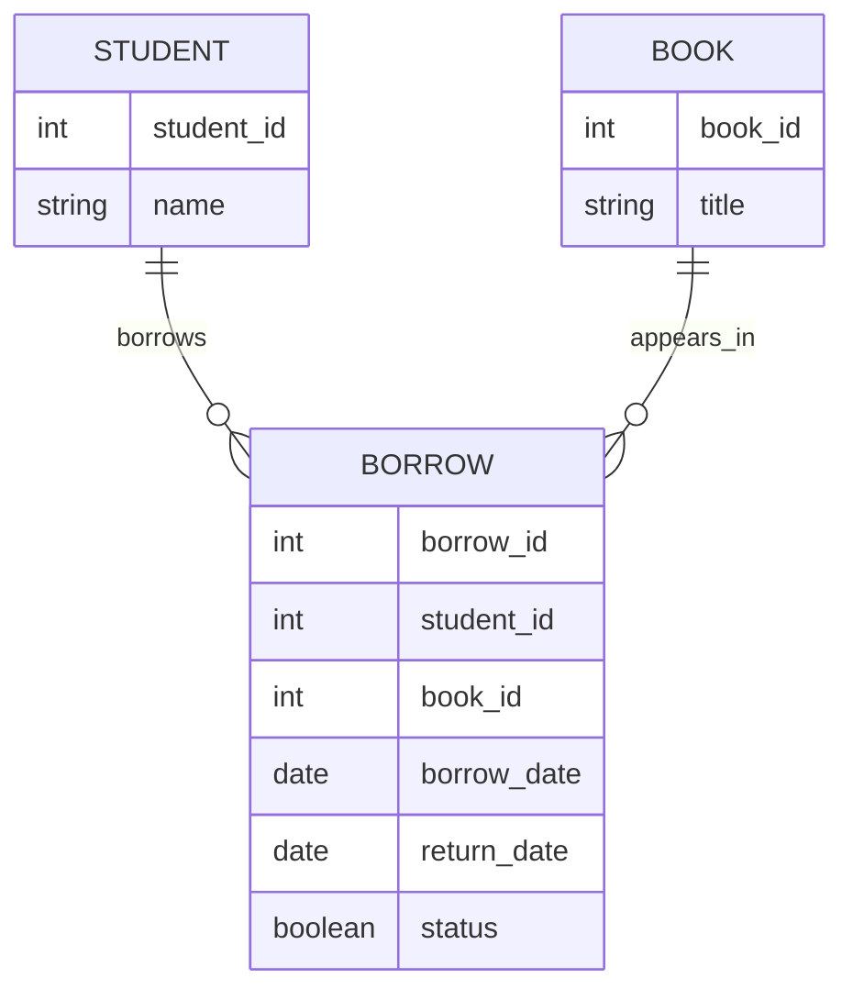

# Library Management System

> A JavaFX + JDBC desktop application for managing book borrowing records with a dark-themed UI.


---

## Table of Contents

- [Overview](#overview)
- [What This Project Does](#what-this-project-does)
- [Interactive Architecture Walkthrough](#interactive-architecture-walkthrough)
- [System Diagram](#system-diagram)
- [Sequence Flow](#sequence-flow)
- [Project Structure](#project-structure)
- [Database Design](#database-design)
- [JDBC Concepts Used](#jdbc-concepts-used)
- [How the Classes Talk to Each Other](#how-the-classes-talk-to-each-other)
- [Getting Started](#getting-started)
- [How to Run](#how-to-run)
- [Current UI Features](#current-ui-features)
- [Notes About the Current Implementation](#notes-about-the-current-implementation)
- [Future Improvements](#future-improvements)
- [License](#license)

---

## Overview

This project is a small desktop **Library Management System** built using:

- **JavaFX** for the graphical user interface
- **FXML** for UI structure
- **CSS** for styling
- **JDBC** for database access
- **MySQL** as the database

The main goal of the project is to demonstrate how a desktop Java application can connect to a relational database and perform CRUD operations using the **DAO pattern**.

---

## What This Project Does

The application allows the user to manage borrowing records in a library system.

The user can:

- select a **book**
- select a **student**
- choose a **borrow date**
- choose a **return date**
- mark a book as returned
- insert a new borrow record
- update an existing borrow record
- delete a borrow record
- view all borrow records
- filter borrowed books
- search by book ID and student ID

---

## Interactive Architecture Walkthrough

This application follows a simple layered structure:

1. **UI Layer**
   - `Borrow.fxml`
   - `BorrowFormStyle.css`
   - `BorrowController.java`

2. **Business / Coordination Layer**
   - `BorrowController.java`
   - This class reacts to button clicks and coordinates between the UI and DAOs.

3. **Data Access Layer**
   - `BookDAO.java`
   - `StudentDAO.java`
   - `BorrowDAO.java`

4. **Database Connection Layer**
   - `DBConnection.java`
   - Manages a single shared JDBC connection using the Singleton pattern.

5. **Model Layer**
   - `Book.java`
   - `Student.java`
   - `Borrow.java`

---


## Sequence Flow

### Borrow book flow



### Return book flow



---

## Project Structure

```text
src/
├── app/
│   └── Main.java
├── config/
│   └── DBConnection.java
├── controllers/
│   └── BorrowController.java
├── dao/
│   ├── BookDAO.java
│   ├── StudentDAO.java
│   └── BorrowDAO.java
├── models/
│   ├── Book.java
│   ├── Student.java
│   └── Borrow.java
├── styles/
│   └── BorrowFormStyle.css
├── views/
│   └── Borrow.fxml
└── README.md
```

### File responsibilities

<details>
<summary><strong>Main.java</strong></summary>

- Launches the JavaFX application
- Loads `Borrow.fxml`
- Closes the database connection in `stop()`

</details>

<details>
<summary><strong>DBConnection.java</strong></summary>

- Loads the MySQL JDBC driver
- Opens the connection lazily
- Reuses one shared connection
- Closes the connection when the application exits

</details>

<details>
<summary><strong>BorrowController.java</strong></summary>

- Handles UI events
- Fills combo boxes
- Reads selected table row data
- Calls DAO methods
- Shows success/warning/confirmation alerts

</details>

<details>
<summary><strong>DAO classes</strong></summary>

- `BookDAO` reads book IDs
- `StudentDAO` reads student IDs
- `BorrowDAO` handles borrow CRUD and filtering

</details>

<details>
<summary><strong>Model classes</strong></summary>

- `Book` represents a book
- `Student` represents a student
- `Borrow` represents a borrowing record

</details>

---

## Database Design

The project uses a relational model where:

- one **student** can borrow many books
- one **book** can be borrowed by many students over time
- the `borrow` table represents the relationship between them

### Conceptual relationship



### Expected columns used in code

`BorrowDAO` currently works with these fields:

- `borrow_id`
- `student_id`
- `book_id`
- `borrow_date`
- `return_date`
- `status`

`BookDAO` reads:

- `book_id`

`StudentDAO` reads:

- `student_id`

---

## JDBC Concepts Used

<details open>
<summary><strong>Connection</strong></summary>

`DBConnection` creates a JDBC connection using `DriverManager.getConnection(...)`.

</details>

<details>
<summary><strong>PreparedStatement</strong></summary>

Used in insert, update, delete, and search operations to safely pass parameters into SQL queries.

</details>

<details>
<summary><strong>Statement</strong></summary>

Used for simple queries like loading all IDs or reading all borrow records.

</details>

<details>
<summary><strong>ResultSet</strong></summary>

Returned from SQL queries and converted into Java model objects.

</details>

<details>
<summary><strong>DAO Pattern</strong></summary>

Each DAO class isolates database logic from UI logic. This keeps the controller cleaner and easier to maintain.

</details>

<details>
<summary><strong>Singleton Pattern</strong></summary>

`DBConnection` uses a singleton so the same connection manager is reused across the application.

</details>

---

## How the Classes Talk to Each Other

### Startup

1. `Main.java` starts the JavaFX application.
2. `Borrow.fxml` is loaded.
3. JavaFX creates `BorrowController`.
4. `initialize(...)` runs automatically.
5. The controller asks `BookDAO` and `StudentDAO` for IDs.
6. Those DAOs ask `DBConnection` for the database connection.

### When the user clicks Borrow

1. `BorrowController.borrowHandle(...)` is called.
2. The controller reads values from the UI.
3. A `Borrow` object is created.
4. `BorrowDAO.insertOne(...)` inserts the row into the database.
5. The table is refreshed with `BorrowDAO.findAll()`.

### When the user clicks Return

1. The selected table row becomes a `Borrow` object.
2. The controller updates `returnDate` and `status`.
3. `BorrowDAO.updateOne(...)` updates the row in MySQL.

### When the user clicks Delete

1. The controller gets the selected row.
2. A confirmation alert is shown.
3. `BorrowDAO.deleteOne(...)` removes the row from the database.

### When the app closes

1. JavaFX calls `Main.stop()`
2. `Main.stop()` calls `DBConnection.getInstance().close()`
3. The JDBC connection is closed safely

---

## Getting Started

### Requirements

- Java 17 or later
- JavaFX SDK
- MySQL Server
- MySQL JDBC Driver
- NetBeans, IntelliJ IDEA, or another Java IDE

### 1. Configure the database connection

Edit `config/DBConnection.java`:

```java
private static final String URL = "jdbc:mysql://localhost:3306/library-system";
private static final String USER = "root";
private static final String PASSWORD = "";
```

Set these values to match your local MySQL setup.

### 2. Create the database

Create your MySQL database and tables so they match the table/column names used in the DAOs.

### 3. Add the JDBC driver

Add the MySQL connector JAR to the project libraries/classpath.

### 4. Run the project

Run `app/Main.java`.

---

## How to Run

### Typical user steps

1. Launch the application
2. Click `View` to load current borrow records
3. Choose a book and a student
4. Select a borrow date
5. Click `Borrow`
6. Select a row from the table to return or delete it
7. Use `borrowedBooks` or `search by ids` for quick filtering

---

## Current UI Features

- dark theme UI using JavaFX CSS
- combo boxes for book ID and student ID
- date pickers for borrow/return dates
- status checkbox for returned state
- table view for displaying borrow records
- alert dialogs for success, warnings, and confirmation

---

## Notes About the Current Implementation

<details open>
<summary><strong>Important notes</strong></summary>

- The app currently uses a **single shared JDBC connection** through `DBConnection`.
- The DB connection is closed when the JavaFX app exits.
- DAO methods should still close `Statement`, `PreparedStatement`, and `ResultSet` properly.
- Some README examples that describe transactions or enum status are conceptual; the current code uses a simpler implementation and stores `status` as a boolean.

</details>

<details>
<summary><strong>Current controller behavior</strong></summary>

- `BorrowController` initializes table columns and combo boxes
- alerts are centralized in helper methods
- the selected row populates the form fields
- search and filter operations refresh the same table

</details>

---

## Future Improvements

- add proper transaction handling for borrow/return operations
- add validation for all user inputs
- use `try-with-resources` in DAO methods
- add book title and student name instead of showing IDs only
- add dashboards/statistics
- add overdue calculation
- migrate from a singleton connection to a connection pool

---

## License

This project is licensed under the MIT License and can be used for learning and educational purposes.

---

> Built as a practical JDBC + JavaFX learning project.
