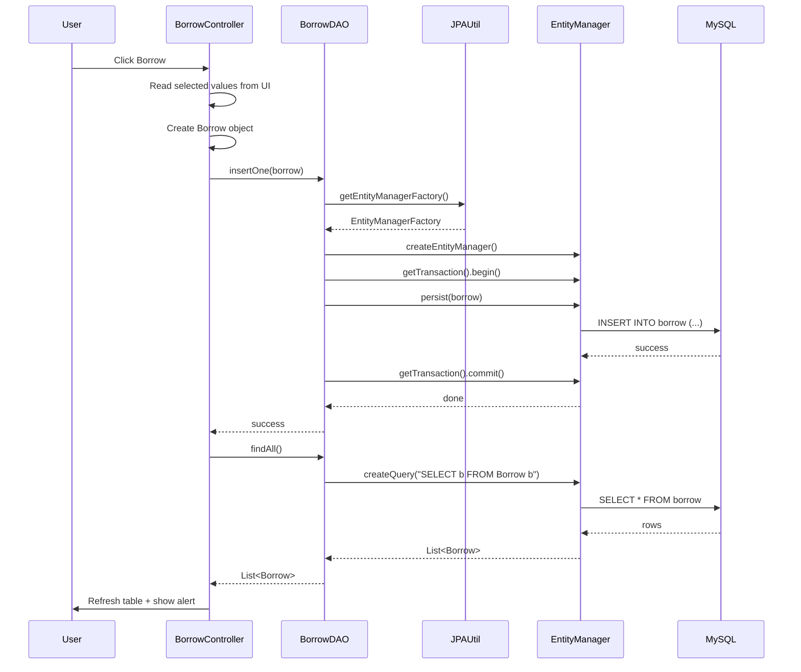
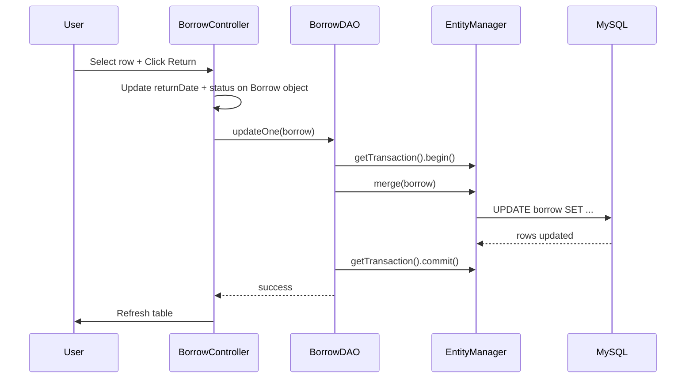
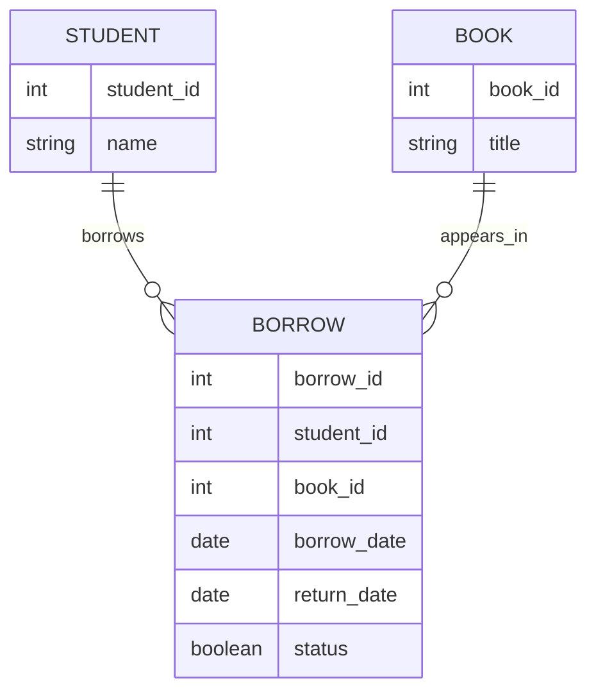

# Library Management System

> A JavaFX + JPA (EclipseLink) desktop application for managing book borrowing records with a dark-themed UI.


---

## Table of Contents

- [Overview](#overview)
- [What This Project Does](#what-this-project-does)
- [JDBC vs JPA — What Changed and Why](#jdbc-vs-jpa--what-changed-and-why)
- [Interactive Architecture Walkthrough](#interactive-architecture-walkthrough)
- [System Diagram](#system-diagram)
- [Sequence Flow](#sequence-flow)
- [Project Structure](#project-structure)
- [Database Design](#database-design)
- [JPA Concepts Used](#jpa-concepts-used)
- [How the Classes Talk to Each Other](#how-the-classes-talk-to-each-other)
- [Getting Started](#getting-started)
- [How to Run](#how-to-run)
- [Current UI Features](#current-ui-features)
- [Notes About the Current Implementation](#notes-about-the-current-implementation)
- [Future Improvements](#future-improvements)
- [License](#license)

---

## Overview

This project is a small desktop **Library Management System** built using:

- **JavaFX** for the graphical user interface
- **FXML** for UI structure
- **CSS** for styling
- **JPA (Java Persistence API)** with **EclipseLink** as the provider for database access
- **MySQL** as the database

The main goal of the project is to demonstrate how a desktop Java application can connect to a relational database and perform CRUD operations using the **DAO pattern** backed by JPA — replacing raw JDBC with a higher-level ORM approach.

---

## What This Project Does

The application allows the user to manage borrowing records in a library system.

The user can:

- select a **book**
- select a **student**
- choose a **borrow date**
- choose a **return date**
- mark a book as returned
- insert a new borrow record
- update an existing borrow record
- delete a borrow record
- view all borrow records
- filter borrowed books
- search by book ID and student ID

---

## JDBC vs JPA — What Changed and Why

This section explains the key differences between the original JDBC implementation and the new JPA/EclipseLink implementation.

| Aspect | JDBC (original) | JPA / EclipseLink (current) |
|---|---|---|
| **Database connection** | `DBConnection.java` using `DriverManager.getConnection()` | `EntityManagerFactory` created from `persistence.xml` |
| **SQL queries** | Written manually as strings | Replaced by JPQL or `EntityManager` methods |
| **Object mapping** | Manual — `ResultSet` → Java object | Automatic — EclipseLink maps annotated entity classes |
| **Insert** | `PreparedStatement` with `ps.setInt(...)` | `em.persist(object)` |
| **Update** | `PreparedStatement` with `UPDATE` SQL | `em.merge(object)` |
| **Delete** | `PreparedStatement` with `DELETE` SQL | `em.remove(em.find(...))` |
| **Find by ID** | Manual `SELECT WHERE id = ?` | `em.find(Class, id)` |
| **Find all** | Manual `SELECT * FROM table` | JPQL: `SELECT b FROM Borrow b` |
| **Transactions** | Manual `conn.setAutoCommit(false)` / `commit()` | `em.getTransaction().begin()` / `commit()` |
| **Schema creation** | You create tables manually in MySQL | Configurable via `persistence.xml` (`create`, `update`, `none`) |
| **Model classes** | Plain Java classes | Annotated with `@Entity`, `@Id`, `@Column`, etc. |
| **Relationships** | Foreign keys handled manually in SQL | Mapped with `@ManyToOne`, `@OneToMany`, etc. |
| **Config file** | JDBC URL hardcoded in `DBConnection.java` | Centralized in `src/META-INF/persistence.xml` |

### Why JPA?

- **Less boilerplate**: No more manual `ResultSet` iteration or `PreparedStatement` parameter binding.
- **Object-oriented thinking**: You work with Java objects directly, not SQL rows.
- **Portability**: Switching databases only requires changing the driver and URL in `persistence.xml`.
- **Relationships are first-class citizens**: No need to manually join tables — JPA navigates relationships for you.

---

## Interactive Architecture Walkthrough

This application follows a simple layered structure:

1. **UI Layer**
   - `Borrow.fxml`
   - `BorrowFormStyle.css`
   - `BorrowController.java`

2. **Business / Coordination Layer**
   - `BorrowController.java`
   - Reacts to button clicks and coordinates between the UI and DAOs.

3. **Data Access Layer**
   - `BookDAO.java`
   - `StudentDAO.java`
   - `BorrowDAO.java`
   - DAOs now use `EntityManager` instead of raw SQL statements.

4. **Persistence Layer**
   - `JPAUtil.java`
   - Creates and provides a shared `EntityManagerFactory` using the Singleton pattern.
   - Replaces the old `DBConnection.java`.

5. **Model Layer (JPA Entities)**
   - `Book.java` — annotated with `@Entity`
   - `Student.java` — annotated with `@Entity`
   - `Borrow.java` — annotated with `@Entity`, with `@ManyToOne` relationships to `Book` and `Student`

6. **Configuration**
   - `src/META-INF/persistence.xml`
   - Defines the persistence unit, JDBC URL, EclipseLink as provider, and schema generation strategy.

---

## Sequence Flow

### Borrow book flow



### Return book flow



---

## Project Structure

```text
src/
├── app/
│   └── Main.java
├── config/
│   └── JPAUtil.java                  ← replaces DBConnection.java
├── controllers/
│   └── BorrowController.java
├── dao/
│   ├── BookDAO.java
│   ├── StudentDAO.java
│   └── BorrowDAO.java
├── models/
│   ├── Book.java                     ← @Entity
│   ├── Student.java                  ← @Entity
│   └── Borrow.java                   ← @Entity with @ManyToOne
├── styles/
│   └── BorrowFormStyle.css
├── views/
│   └── Borrow.fxml
└── META-INF/
    └── persistence.xml               ← JPA configuration
```

### File responsibilities

<details>
<summary><strong>Main.java</strong></summary>

- Launches the JavaFX application
- Loads `Borrow.fxml`
- Closes the `EntityManagerFactory` in `stop()` by calling `JPAUtil.close()`

</details>

<details>
<summary><strong>JPAUtil.java</strong></summary>

- Creates the `EntityManagerFactory` once using `Persistence.createEntityManagerFactory("libraryPU")`
- Exposes `getEntityManagerFactory()` for DAOs to use
- Exposes `close()` to shut down the factory cleanly when the app exits
- Uses the Singleton pattern — one factory shared across the application

</details>

<details>
<summary><strong>persistence.xml</strong></summary>

- Defines the persistence unit name (`libraryPU`)
- Lists all entity classes
- Configures the JDBC URL, username, password, and driver
- Sets EclipseLink as the JPA provider
- Controls schema generation (e.g., `create`, `update`, or `none`)

</details>

<details>
<summary><strong>BorrowController.java</strong></summary>

- Handles UI events
- Fills combo boxes
- Reads selected table row data
- Calls DAO methods
- Shows success/warning/confirmation alerts

</details>

<details>
<summary><strong>DAO classes</strong></summary>

- `BookDAO` reads book IDs using JPQL
- `StudentDAO` reads student IDs using JPQL
- `BorrowDAO` handles borrow CRUD using `em.persist()`, `em.merge()`, `em.remove()`, and JPQL queries

</details>

<details>
<summary><strong>Model / Entity classes</strong></summary>

- `Book` — `@Entity`, represents a book row
- `Student` — `@Entity`, represents a student row
- `Borrow` — `@Entity`, represents a borrowing record; uses `@ManyToOne` to reference `Book` and `Student`

</details>

---

## Database Design

The project uses a relational model where:

- one **student** can borrow many books
- one **book** can be borrowed by many students over time
- the `borrow` table represents the relationship between them

In JPA, these relationships are expressed using annotations directly on the entity classes instead of being handled manually in SQL.

### Conceptual relationship



### Entity annotations used

`Borrow.java` uses:

```java
@Entity
@Table(name = "borrow")
public class Borrow {

    @Id
    @GeneratedValue(strategy = GenerationType.IDENTITY)
    private int borrowId;

    @ManyToOne
    @JoinColumn(name = "book_id")
    private Book book;

    @ManyToOne
    @JoinColumn(name = "student_id")
    private Student student;

    private LocalDate borrowDate;
    private LocalDate returnDate;
    private boolean status;
}
```

`Book.java` and `Student.java` use `@Entity`, `@Id`, and `@Column` annotations to map their fields to database columns.

---

## JPA Concepts Used

<details open>
<summary><strong>EntityManagerFactory</strong></summary>

Created once at startup by `JPAUtil`. Manages connection pooling and the JPA provider configuration. Expensive to create — only one instance should exist per application.

</details>

<details>
<summary><strong>EntityManager</strong></summary>

A lightweight unit-of-work object. DAOs create a new `EntityManager` per operation or per transaction, then close it after use. It is the main API for persisting and querying entities.

</details>

<details>
<summary><strong>Persistence Unit (persistence.xml)</strong></summary>

The central configuration file that tells JPA which classes are entities, which database to connect to, and which provider (EclipseLink) to use.

</details>

<details>
<summary><strong>@Entity and @Table</strong></summary>

Marks a Java class as a JPA entity that maps to a database table. `@Table(name = "...")` specifies the exact table name if it differs from the class name.

</details>

<details>
<summary><strong>@Id and @GeneratedValue</strong></summary>

`@Id` marks the primary key field. `@GeneratedValue(strategy = GenerationType.IDENTITY)` tells JPA to let the database auto-increment the key.

</details>

<details>
<summary><strong>@ManyToOne and @JoinColumn</strong></summary>

Maps a foreign key relationship between two entities. For example, `Borrow` has a `@ManyToOne` to `Book` — many borrow records can reference one book.

</details>

<details>
<summary><strong>JPQL (Java Persistence Query Language)</strong></summary>

An object-oriented query language that works on entity class names and field names, not table and column names. Example: `SELECT b FROM Borrow b WHERE b.status = false`.

</details>

<details>
<summary><strong>Transactions</strong></summary>

All write operations (insert, update, delete) must be wrapped in a transaction: `em.getTransaction().begin()` → operation → `em.getTransaction().commit()`. If something goes wrong, `em.getTransaction().rollback()` undoes the changes.

</details>

<details>
<summary><strong>persist / merge / remove / find</strong></summary>

The four core `EntityManager` operations that replace manual SQL statements:

| JPA method | Equivalent SQL |
|---|---|
| `em.persist(obj)` | `INSERT INTO ...` |
| `em.merge(obj)` | `UPDATE ... SET ...` |
| `em.remove(em.find(...))` | `DELETE FROM ...` |
| `em.find(Class, id)` | `SELECT ... WHERE id = ?` |

</details>

<details>
<summary><strong>DAO Pattern</strong></summary>

Each DAO class isolates database logic from UI logic. With JPA, DAO methods use the `EntityManager` instead of raw SQL, but the pattern and its benefits remain the same.

</details>

<details>
<summary><strong>Singleton Pattern (JPAUtil)</strong></summary>

`JPAUtil` uses the Singleton pattern so the `EntityManagerFactory` is created only once and reused across all DAOs — consistent with the original `DBConnection` design.

</details>

---

## How the Classes Talk to Each Other

### Startup

1. `Main.java` starts the JavaFX application.
2. `Borrow.fxml` is loaded.
3. JavaFX creates `BorrowController`.
4. `initialize(...)` runs automatically.
5. The controller asks `BookDAO` and `StudentDAO` for IDs.
6. Those DAOs call `JPAUtil.getEntityManagerFactory()` to get an `EntityManager` and run JPQL queries.

### When the user clicks Borrow

1. `BorrowController.borrowHandle(...)` is called.
2. The controller reads values from the UI.
3. A `Borrow` object is created (with `Book` and `Student` references set).
4. `BorrowDAO.insertOne(borrow)` calls `em.persist(borrow)` inside a transaction.
5. The table is refreshed using `BorrowDAO.findAll()` which runs a JPQL `SELECT` query.

### When the user clicks Return

1. The selected table row becomes a `Borrow` object.
2. The controller updates `returnDate` and `status` on the object.
3. `BorrowDAO.updateOne(borrow)` calls `em.merge(borrow)` inside a transaction.

### When the user clicks Delete

1. The controller gets the selected row.
2. A confirmation alert is shown.
3. `BorrowDAO.deleteOne(id)` calls `em.find(Borrow.class, id)` then `em.remove(found)` inside a transaction.

### When the app closes

1. JavaFX calls `Main.stop()`
2. `Main.stop()` calls `JPAUtil.close()`
3. The `EntityManagerFactory` is closed safely, releasing all resources

---

## Getting Started

### Requirements

- Java 17 or later
- JavaFX SDK
- MySQL Server 8.0
- EclipseLink JPA provider JAR (or via Maven/Gradle dependency)
- MySQL JDBC Driver
- NetBeans, IntelliJ IDEA, or another Java IDE

### 1. Configure persistence.xml

Edit `src/META-INF/persistence.xml`:

```xml
<persistence-unit name="libraryPU" transaction-type="RESOURCE_LOCAL">
    <provider>org.eclipse.persistence.jpa.PersistenceProvider</provider>

    <class>models.Book</class>
    <class>models.Student</class>
    <class>models.Borrow</class>

    <properties>
        <property name="javax.persistence.jdbc.driver"   value="com.mysql.cj.jdbc.Driver"/>
        <property name="javax.persistence.jdbc.url"      value="jdbc:mysql://localhost:3306/library-system"/>
        <property name="javax.persistence.jdbc.user"     value="root"/>
        <property name="javax.persistence.jdbc.password" value=""/>

        <!-- Options: create | create-drop | update | none -->
        <property name="eclipselink.ddl-generation"      value="create-tables"/>
        <property name="eclipselink.ddl-generation.output-mode" value="database"/>

        <property name="eclipselink.logging.level"       value="FINE"/>
    </properties>
</persistence-unit>
```

Set the URL, username, and password to match your local MySQL setup.

### 2. Create the database

Create the MySQL database (`library-system`). If `ddl-generation` is set to `create-tables`, EclipseLink will create the tables automatically on first run based on your entity classes.

### 3. Add dependencies

Add the following JARs to your project classpath (or use Maven/Gradle):

- `eclipselink.jar`
- `mysql-connector-j-x.x.x.jar`
- `jakarta.persistence-api-x.x.x.jar` (or `javax.persistence`)

### 4. Run the project

Run `app/Main.java`.

---

## How to Run

### Typical user steps

1. Launch the application
2. Click `View` to load current borrow records
3. Choose a book and a student
4. Select a borrow date
5. Click `Borrow`
6. Select a row from the table to return or delete it
7. Use `borrowedBooks` or `search by ids` for quick filtering

---

## Current UI Features

- dark theme UI using JavaFX CSS
- combo boxes for book ID and student ID
- date pickers for borrow/return dates
- status checkbox for returned state
- table view for displaying borrow records
- alert dialogs for success, warnings, and confirmation

---

## Notes About the Current Implementation

<details open>
<summary><strong>Important notes</strong></summary>

- The app uses a single shared `EntityManagerFactory` through `JPAUtil`.
- Each DAO method creates its own `EntityManager`, uses it, and closes it after the operation.
- Transactions are manually managed using `em.getTransaction().begin()` and `commit()`.
- The `status` field is stored as a boolean in the database.
- EclipseLink logging is set to `FINE` by default, so generated SQL statements are visible in the console — useful for learning and debugging.

</details>

<details>
<summary><strong>Current controller behavior</strong></summary>

- `BorrowController` initializes table columns and combo boxes
- alerts are centralized in helper methods
- the selected row populates the form fields
- search and filter operations use JPQL queries and refresh the same table

</details>

---

## Future Improvements

- Add a `BookDAO.findAll()` and `StudentDAO.findAll()` to display full book and student details
- Use `@OneToMany` on `Book` and `Student` to navigate relationships from the other direction
- Add input validation before persisting
- Introduce a service layer between the controller and DAOs
- Use connection pooling (e.g., HikariCP) for production-readiness
- Add named queries with `@NamedQuery` on entity classes

---

## Lecture Video

This project was built live during the following lecture. Watch it to follow along with the full explanation and code walkthrough.

[](https://youtu.be/qvqxeeke8dg?si=mSMy2p4cIlEaU5JE)

---

## License

This project is licensed under the MIT License and can be used for learning and educational purposes.

---

> Built as a practical JPA + EclipseLink + JavaFX learning project.
